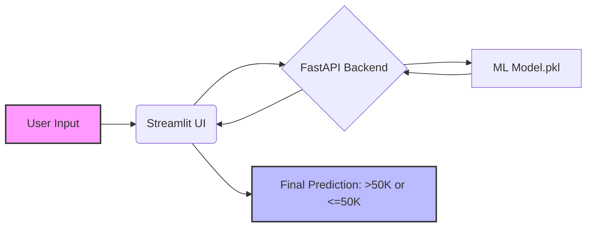

# 💰 Adult Income Classifier <C-S-I-C>

<p align="center">
  
  
  
  
  
</p>

<p align="center">
  <strong>A professional-grade machine learning application to predict whether an individual's annual income exceeds $50K based on census demographic data.</strong>
</p>

---

## 🚀 Live Demo & Deployment
🌐 **Live Application:** [Click Here to Visit the App](https://huggingface.co/spaces/kasaam89/Census-Income-Classifier) 


---

## ✨ Key Features

- 🎨 **Sleek Frontend**: Built with Streamlit for a modern, intuitive user experience.
- ⚡ **High-Performance Backend**: Powered by FastAPI for low-latency predictions.
- 🤖 **Robust ML Pipeline**: Pre-trained classifier utilizing a sophisticated data processing pipeline (scaling & encoding).
- 🐳 **Cloud Ready**: Fully Dockerized for seamless deployment on Hugging Face Spaces.
- 🔍 **Detailed Analysis**: Processes 14 diverse demographic features for high accuracy.

---

## 🏗️ System Architecture



---

## 📊 Data Model Input

The system analyzes 14 key census features:

| Category | Feature | Description |
| :--- | :--- | :--- |
| **Demographics** | Age, Gender, Race | Basic identity information |
| **Education** | Education, Education-num | Academic background |
| **Employment** | Workclass, Occupation | Job-related status |
| **Financials** | Capital Gain, Capital Loss | Monetary indicators |
| **Others** | Marital Status, Relationship, Hours/Week, Country | Lifestyle & Geography |

---

## 🛠️ Technology Stack

- **Core**: `Python 3.11+`
- **Frontend**: `Streamlit`
- **Backend**: `FastAPI` $\rightarrow$ `Uvicorn`
- **Machine Learning**: `Scikit-learn`, `Pandas`, `NumPy`
- **DevOps**: `Docker`, `GitHub Actions`

---

## 🚀 Installation & Local Setup

### 1. Clone & Navigate
```bash
git clone https://github.com/kasa-maker/Census-Income-Classifier.git
cd Census-Income-Classifier
```

### 2. Environment Setup
```bash
python -m venv venv
source venv/bin/activate  # Windows: venv\Scripts\activate
pip install -r requirements.txt
```

### 3. Run Application
**Start Backend:**
```bash
uvicorn main:app --reload
```
**Start Frontend:**
```bash
streamlit run app.py
```

---

## 📁 Project Structure

```text
Census-Income-Classifier/
├── app.py           # 🎨 Streamlit Dashboard
├── main.py          # ⚡ FastAPI Backend Logic
├── model.pkl        # 🤖 Pre-trained ML Model
├── requirements.txt # 📦 Project Dependencies
├── Dockerfile       # 🐳 Containerization Blueprint
├── start.sh         # ⚙️ Service Orchestrator
└── README.md        # 📝 Documentation
```

---

## 🤝 Contributing

Contributions make the open-source community amazing!
1. Fork the Project
2. Create your Feature Branch (`git checkout -b feature/AmazingFeature`)
3. Commit your Changes (`git commit -m 'Add some AmazingFeature'`)
4. Push to the Branch (`git push origin feature/AmazingFeature`)
5. Open a Pull Request

---

## 👤 Author

**Kasa-Maker** 🚀
- GitHub: [@kasa-maker](https://github.com/kasa-maker)

<p align="center">
  ⭐ <b>If you like this project, please give it a star!</b> ⭐
</p>
